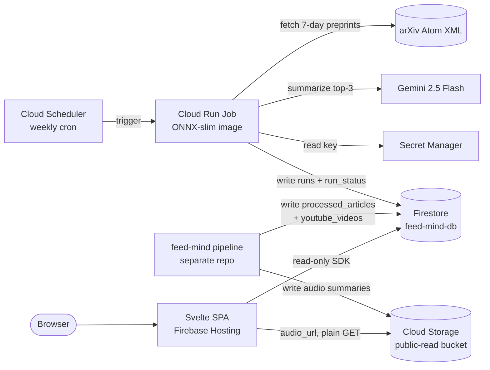

# paper-prism

A **$0, zero-ops, personalized weekly arXiv research digest.** A scheduled batch
job fetches the last 7 days of preprints across three research lenses, ranks each
against a personal interest profile using local ONNX embeddings, summarizes the
top papers with Gemini, and writes the results to Firestore. A Svelte SPA reads
Firestore directly — no backend API, no request-path compute.

The SPA has since grown into a three-section reader (shipped as **feed-mind**):

| Section | Route | Collection | Written by |
|---|---|---|---|
| News | `#/` (landing) | `processed_articles` | sibling `feed-mind` RSS pipeline |
| Papers | `#/papers` | `runs` + `run_status` | this repo's `pipeline/` |
| Videos | `#/videos` | `youtube_videos` | sibling `feed-mind` pipeline |

All four collections live in the **same** named Firestore database
(`feed-mind-db`), and the browser reads all of them directly. This repo owns
`firestore.rules` for the whole database.

Every component runs inside a perpetual free tier; the $10/month Google Cloud
credit is buffer, not a dependency.

📄 Full design: [`docs/paper-prism-prd.md`](docs/paper-prism-prd.md)

## Architecture



**Three lenses** (each with its own interest profile, generative-AI interest
folded into the profile text — not a separate bucket):

| Lens | `category` | arXiv sources |
|---|---|---|
| AI / ML | `AIML` | `cs.LG`, `cs.AI` |
| NLP | `NLP` | `cs.CL` |
| Computer Vision | `CV` | `cs.CV` |

Pipeline is best-effort per lens; ranking is authoritative (cosine similarity),
Gemini only summarizes and a failed summary is written as `null` rather than
dropping the paper. Each stored paper carries both the Gemini `summary` and the
author's `abstract` verbatim from arXiv — the card shows the summary and keeps
the abstract behind a disclosure.

**News cards** additionally carry `ai_summary` (a longer LLM summary, behind an
"AI summary" disclosure) and `audio_url` (its spoken version, played by the
card's Listen button) for every category **except `open-source`**, whose entries
are evergreen links pinned client-side and have no pipeline-generated content.
Both fields are optional throughout: missing ones simply hide their control, so
documents written before the fields existed still render.

## Repository layout

| Path | What | Phase |
|---|---|---|
| [`pipeline/`](pipeline/) | Python batch: arXiv → ONNX embed → top-3 cosine → Gemini → Firestore | P1 |
| [`pipeline/Dockerfile`](pipeline/Dockerfile) + [`pipeline/deploy/`](pipeline/deploy/) | ONNX-slim image + `gcloud` deploy scripts | P2 |
| [`web/`](web/) | Svelte SPA reading Firestore directly — News / Papers / Videos, each with Latest + Archive | P3 |
| [`infra/`](infra/) | Terraform for the whole GCP stack + run-failure alerting | P4 |
| [`firestore.rules`](firestore.rules) / [`firestore.indexes.json`](firestore.indexes.json) / [`firebase.json`](firebase.json) | Firestore public-read rules, composite index, Hosting config | — |
| [`docs/`](docs/) | PRD | — |

## Quick start (fully local, no cloud)

**Pipeline** — runs against live arXiv, writes JSON locally (summaries `null`
without a Gemini key):

```bash
cd pipeline
python3 -m venv .venv && .venv/bin/python -m pip install -r requirements.txt
cp .env.example .env            # edit the three PROFILE_* paragraphs
PYTHONPATH=src .venv/bin/python -m paper_prism
```

**Web** — runs against bundled fixtures (mock mode):

```bash
cd web
npm install
npm run dev                     # http://localhost:5173
```

## Deploy to GCP

See per-component READMEs — [`pipeline/deploy/README.md`](pipeline/deploy/README.md)
(imperative `gcloud`, quick start) and [`infra/README.md`](infra/README.md)
(Terraform, source of truth for P4+). In short:

```bash
# 1. Infra (Terraform)
cd infra && cp terraform.tfvars.example terraform.tfvars   # fill in
export TF_VAR_gemini_api_key=...                            # AI Studio key
terraform init && terraform apply

# 2. Build & push the pipeline image to the created registry
cd ../pipeline/deploy && PROJECT_ID=... ./02-build-push.sh

# 3. Smoke test — first real end-to-end run (Gemini + Firestore)
gcloud run jobs execute paper-prism-job --region us-central1 --wait

# 4. Frontend against live Firestore
cd ../../web
# set VITE_DATA_SOURCE=firestore + VITE_FIREBASE_* in .env,
# and VITE_FIRESTORE_DATABASE to match the pipeline's FIRESTORE_DATABASE
npm run build
firebase deploy --only hosting
firebase deploy --only firestore:rules,firestore:indexes
```

> **Named Firestore database.** The pipeline writes to `FIRESTORE_DATABASE`
> (default `feed-mind-db`), not `(default)`. On the `gcloud` path,
> `pipeline/deploy/01b-setup-firestore-db.sh` provisions it (create + TTL +
> `runs` index). The reader and writer must agree: pipeline `FIRESTORE_DATABASE`
> = web `VITE_FIRESTORE_DATABASE`, or the SPA reads an empty `(default)`.

> The P2 `gcloud` scripts and P4 Terraform create the **same resources** — pick
> one as source of truth (import or tear down before running the other).

> **Audio summaries.** News cards fetch `audio_url` straight from Cloud Storage
> with a plain `GET` — no signed URLs, no backend. The bucket must therefore be
> **public-read**, and objects must be served with a real audio `Content-Type`
> (`audio/mpeg` for mp3): Chrome's Opaque Response Blocking rejects a media
> response typed `application/octet-stream` or XML, and the card falls back to
> its "Audio unavailable" state. The bucket is provisioned by the feed-mind
> repo, not here.

## Cost

A weekly ~3–5 min run at 2 vCPU / 2 GiB is a rounding error against the Cloud Run
free grant; Firestore, Secret Manager, Firebase Hosting, and the Gemini AI Studio
tier all sit inside perpetual free limits. Total: **$0.00/month**. Keep only the
`:latest` image tag and prune old Artifact Registry digests to stay under the
0.5 GB free storage line. See PRD §1.3.

The audio summaries are the one component with a genuinely open-ended cost:
public-bucket **egress is billed per download**, and it scales with readers
rather than with the pipeline. Storage itself stays trivial if the objects
expire on a lifecycle rule matching the 7-day news window.

## Status

| Phase | State |
|---|---|
| P1 pipeline | ✅ validated live (arXiv fetch, ranking, JSON output) |
| P2 container + deploy | ✅ image built & container run verified; scripts unrun against real GCP |
| P3 web | ✅ validated headless (0 console errors) in mock mode; `npm test` covers the data layer |
| P4 Terraform + alerting | ✅ `terraform validate` passes |

Not yet exercised (needs a live GCP project): Firestore writes, the live Gemini
summary path, Cloud Run/Scheduler execution, and Firebase Hosting deploy. The
news **audio playback** path is verified only against a stubbed response — it
has not been played from a real Cloud Storage object.
