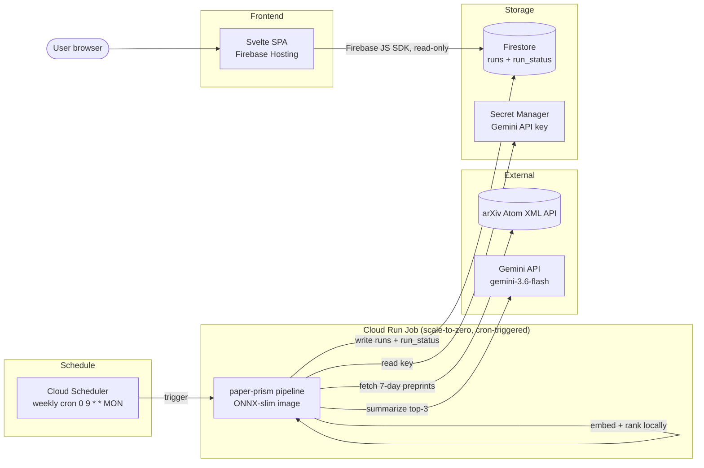

# `paper-prism` — Product Requirements Document

**A $0, zero-ops, personalized weekly arXiv research digest.**

| | |
|---|---|
| **Status** | Approved for build |
| **Owner** | shankotai@gmail.com |
| **Last updated** | 2026-08-12 |
| **Platform** | Google Cloud Platform + Firebase |
| **Cost posture** | $0 usage inside perpetual free tiers; $10/mo Cloud credit is buffer, not a dependency |

---

## 1. Executive Summary & Cost / Freshness Boundaries

### 1.1 Summary

`paper-prism` fetches the last 7 days of arXiv preprints across three research
lenses, ranks each lens against a personal free-text interest profile using
local ONNX embeddings, writes a 2-sentence Gemini-generated innovation summary
for the top papers, and stores the result in Firestore. A Svelte single-page app
on Firebase Hosting reads Firestore **directly** (no backend API) and renders a
Latest tab and an Archive tab.

The system is a **scheduled batch pipeline + a static read-only frontend** — not
a request/response service. There is no server to cold-start, no REST API, and
no always-on compute.

### 1.2 Design principles

- **Free-tier-native.** Every component runs inside a perpetual GCP/Firebase free
  tier. The $10/month Google Cloud credit from the Gemini/AI Pro subscription is
  treated as headroom, never as a line item the design depends on.
- **Fewest moving parts.** The data itself is the public contract; the browser
  talks to Firestore directly. Deleting the backend API also deleted its entire
  class of failure modes (cold starts, CORS, wake-up UX).
- **Graceful degradation.** A weekly batch touching two flaky external services
  (arXiv, Gemini) *will* partially fail. Every failure mode has a defined,
  non-fatal behavior.

### 1.3 Cost allocation

| Service | Free-tier allowance | `paper-prism` usage | Cost |
|---|---|---|---|
| Cloud Run Job | 180k vCPU-s + 360k GiB-s / mo | ~4 runs/mo × ~3–5 min | $0 |
| Cloud Scheduler | 3 jobs free | 1 job | $0 |
| Firestore | 1 GiB storage, 50k reads / 20k writes per day | ~9 writes/run; ~24 reads/page-view | $0 |
| Artifact Registry | 0.5 GiB storage | ONNX-slim image ~300–400 MB | $0 |
| Secret Manager | 6 active versions, 10k access ops/mo | 1 secret | $0 |
| Gemini API (AI Studio) | Free-tier RPM/RPD limits | ~9 short calls/run | $0 |
| Firebase Hosting (Spark) | 10 GB storage, 360 MB/day transfer | tiny SPA | $0 |
| Cloud Logging / Monitoring | Free allotment + 1 alert policy | log-based alert | $0 |
| **Total** | | | **$0.00 / month** |

### 1.4 Freshness / staleness SLA

| Property | Target |
|---|---|
| Run cadence | Weekly, Monday 09:00 (Cloud Scheduler cron) |
| Per-category freshness | ≤ 7 days when the pipeline succeeds |
| Degraded freshness | A failed category retains the **previous** week's document as "latest" and is flagged stale in `run_status` |
| Failure visibility | `run_status` doc (UI) + log-based email alert (operator) within one run cycle |

---

## 2. System Architecture



**Key property:** there is no request-path compute. The only executable is a
weekly batch Job; the frontend is static assets reading Firestore directly.

---

## 3. Functional Specifications & Data Flow

### 3.1 Interest profiles

- **Three** free-text interest profiles, one per lens, stored as **environment
  variables** on the Cloud Run Job (editable without redeploying the image).
- Each profile is a paragraph describing what the user cares about within that
  lens. Generative-AI interest is expressed *inside* these paragraphs (e.g. the
  NLP profile emphasizes LLMs; the CV profile emphasizes diffusion / text-to-image)
  — there is no separate "Gen AI" bucket.
- Each profile is embedded once per run (a single MiniLM forward pass) to produce
  the reference vector for its lens. No caching required.

| Lens | `category` | arXiv source categories |
|---|---|---|
| AI / Machine Learning | `AIML` | `cs.LG`, `cs.AI` |
| Natural Language Processing | `NLP` | `cs.CL` |
| Computer Vision | `CV` | `cs.CV` |

### 3.2 Pipeline execution flow (per run)

For each lens, independently (**best-effort per category**):

1. **Fetch.** Query the arXiv **Atom XML** API for the lens's source categories,
   filtering to `submittedDate` within the last 7 days.
   - Throttle to ~1 request / 3 s.
   - Paginate via `start` / `max_results`.
   - Retry with exponential backoff on empty/error responses.
   - Resolve cross-listed papers to their **primary** arXiv category so a paper
     appears in at most one lens.
2. **Embed.** Build `title + "\n" + abstract` for each candidate; embed with
   **ONNX Runtime + all-MiniLM-L6-v2** (mean-pooled). Embed the lens profile the
   same way.
3. **Rank.** Compute cosine similarity of each candidate to the profile vector;
   take the **top 3** (fewer if the window yielded < 3). Cosine is the
   authoritative `score`. *(There is no 15-candidate intermediate and no LLM
   re-ranking.)*
4. **Summarize.** For each of the top-3, call **gemini-3.6-flash** with a grounded
   prompt (see 3.4) to produce a 2-sentence key-innovation summary.
5. **Persist.** Write one Firestore document per (run, category) with deterministic
   ID `YYYY-MM-DD_<CATEGORY>`, overwriting any existing doc for that key.

After all lenses complete, write/overwrite the **`run_status`** document.

### 3.3 Failure semantics

| Failure | Behavior |
|---|---|
| arXiv fetch fails for a lens | Skip that lens; its previous doc remains "latest"; mark stale in `run_status`. Other lenses proceed. |
| Gemini summary fails for a paper (rate limit, safety block, timeout) | Write the paper with `summary: null`; ranking is unaffected. |
| Fewer than 3 papers in window | Write whatever is available (0–2). |
| Whole Job crashes | Cloud Scheduler retry re-runs; deterministic IDs make re-runs idempotent (recompute + overwrite). |
| Hard failure (uncaught) | Log-based alert emails the operator. |

### 3.4 Gemini prompt

> *"In exactly 2 sentences, state this paper's key innovation. Use only the
> provided title and abstract; do not speculate or add information not present."*

Inputs: paper title + abstract. A safety block or empty response is treated as a
summary failure → `summary: null` (§3.3).

### 3.5 Frontend data flow

- **Latest tab.** For each of the 3 lenses:
  `runs.where('category','==',X).orderBy('run_date','desc').limit(1)` → render
  top-3 papers (title, score, summary or an "summary unavailable" state).
- **Archive tab.** Same query with `.limit(5)` per lens → historical runs grouped
  by lens.
- **Freshness indicator.** Read `run_status`; surface a subtle "NLP last updated
  N days ago / stale" badge when a lens is behind.
- **State handling.** Loading and empty/`null`-summary states are first-class in
  the UI. There is no cold-start/wake-up state — Firestore reads are immediate.

---

## 4. Firestore Data Model, Query Patterns & Security Rules

*(This section replaces the API/OpenAPI contract — with Path A, the Firestore
schema is the public, browser-facing contract.)*

### 4.1 Collection: `runs`

Flat collection, one document per (run, category), denormalized `papers[]` inline
(only ever 3 items, so no subcollection).

```json
{
  "id": "2026-08-10_AIML",
  "run_date": "2026-08-10T09:00:00Z",
  "category": "AIML",
  "papers": [
    {
      "rank": 1,
      "title": "…",
      "arxiv_id": "2508.01234",
      "url": "https://arxiv.org/abs/2508.01234",
      "score": 0.94,
      "summary": "… two sentences …",
      "abstract": "… the author's abstract, verbatim from arXiv …"
    }
  ]
}
```

- `id` — deterministic, `YYYY-MM-DD_<CATEGORY>`; re-runs overwrite cleanly.
- `run_date` — **Firestore Timestamp**, sortable, drives "latest" and "archive".
- `category` — enum `{ "AIML", "NLP", "CV" }`.
- `papers[]` — length 0–3; `summary` is **nullable**.
- `summary` vs `abstract` — `summary` is the **Gemini-generated** blurb (null when
  that call fails); `abstract` is the **author's abstract** as fetched from the
  arXiv Atom feed (where the field is confusingly also named `summary`). The
  abstract is not backfilled, so it is absent on documents written before it was
  added — readers must tolerate `undefined`.
- `score` — raw cosine similarity to the lens profile.

### 4.2 Collection: `run_status`

One document per run (or a single rolling doc), summarizing per-lens outcome for
UI freshness and operator visibility.

```json
{
  "id": "2026-08-10",
  "run_date": "2026-08-10T09:00:00Z",
  "categories": {
    "AIML": { "status": "ok",      "paper_count": 3 },
    "NLP":  { "status": "skipped", "reason": "arxiv_timeout" },
    "CV":   { "status": "ok",      "paper_count": 3 }
  }
}
```

### 4.3 Query patterns

| View | Query | Reads |
|---|---|---|
| Latest (per lens) | `where(category==X).orderBy(run_date desc).limit(1)` × 3 | 3 |
| Archive (per lens) | `where(category==X).orderBy(run_date desc).limit(5)` × 3 | ≤ 15 |
| Freshness | latest `run_status` doc | 1 |

Well inside Firestore's 50k reads/day free quota.

### 4.4 Indexes

Composite index required (declared in `firestore.indexes.json`):

- Collection `runs`: `category` (ASC) + `run_date` (DESC).

### 4.5 Security rules

```
rules_version = '2';
service cloud.firestore {
  match /databases/{db}/documents {
    match /runs/{doc}       { allow read: if true; allow write: if false; }
    match /run_status/{doc} { allow read: if true; allow write: if false; }
  }
}
```

Writes occur **server-side** under the Job's service account via the Admin SDK,
which bypasses these rules. The browser is read-only.

---

## 5. Non-Functional Requirements

- **Compute model.** Cloud Run **Job** (not a service): cron-triggered,
  run-to-completion, scales to zero between runs. No `minReplicas`, no idle cost.
- **Idempotency.** Deterministic doc IDs + always-overwrite semantics make any
  retry safe.
- **Resilience.** Per-category isolation; retry-with-backoff on arXiv; nullable
  summaries on Gemini failure; no run aborts on a single-lens or single-paper
  failure.
- **Observability.** `run_status` doc (user-facing freshness) **+** a Cloud
  Logging log-based metric with a Monitoring alert policy emailing the operator on
  hard failure.
- **Security & identity.** A **dedicated least-privilege service account** for the
  Job with exactly: Firestore write (`datastore.user`) + Secret Manager accessor.
  Not the default compute SA. The **Gemini API key lives in Secret Manager** and
  is mounted into the Job at runtime.
- **Image footprint.** ONNX-slimmed image (`onnxruntime` + `tokenizers` +
  `all-MiniLM-L6-v2.onnx`, no `torch`), ~300–400 MB, staying under the Artifact
  Registry free-storage line and minimizing Cloud Run cold start.
- **Frontend.** Static SPA; no runtime backend. Public read-only Firestore access
  via the Firebase JS SDK (the Firebase web config is not a secret).

---

## 6. Deployment & Infrastructure-as-Code (Terraform)

All infrastructure is declared in **Terraform**. Resources:

| Resource | Terraform type (indicative) |
|---|---|
| Artifact Registry repo | `google_artifact_registry_repository` |
| Cloud Run Job | `google_cloud_run_v2_job` |
| Cloud Scheduler job | `google_cloud_scheduler_job` (invokes the Job) |
| Firestore database + indexes | `google_firestore_database`, `google_firestore_index` (+ `firestore.indexes.json`) |
| Secret Manager secret + version | `google_secret_manager_secret[_version]` |
| Service account + IAM bindings | `google_service_account`, `google_project_iam_member` (Firestore, Secret accessor) |
| Log-based metric + alert policy | `google_logging_metric`, `google_monitoring_alert_policy` |
| Firebase Hosting | `google_firebase_hosting_site` (+ Firebase config) |

Image build/push (GitHub Actions → Artifact Registry) is CI, not Terraform.
Interest-profile env vars are set on the Cloud Run Job (config, not image).

---

## 7. Implementation Roadmap

**P1 — Pipeline, locally.**
Author the 3 interest profiles. Implement arXiv fetch (Atom XML, throttle,
paginate, retry) → ONNX MiniLM embed → top-3 cosine → Gemini summarize → write to
Firestore. Validate documents and query patterns end-to-end from a laptop.

**P2 — Containerize & deploy the batch.**
Build the ONNX-slim image → Artifact Registry → Cloud Run Job → Cloud Scheduler
weekly trigger. Wire Secret Manager + the dedicated service account. Confirm a
real scheduled run writes correct docs.

**P3 — Frontend.**
Svelte SPA reading Firestore directly (Latest + Archive tabs, freshness badge,
null-summary and empty states) → deploy to Firebase Hosting.

**P4 — Hardening & IaC.**
`run_status` doc + log-based email alert. Codify all infrastructure in Terraform
(+ `firestore.indexes.json`). Verify $0 billing and the freshness SLA over a few
cycles.

---

## Appendix A — Explicitly removed from the original concept

| Removed | Reason |
|---|---|
| Azure (Functions, Cosmos, Container Apps, Static Web Apps) | Pivoted to GCP/Firebase |
| Azure Functions / Consumption plan | torch-on-Consumption is a package-size/memory/cold-start trap; replaced by a Cloud Run Job |
| FastAPI + Cloud Run *service* + `/api/*` endpoints | Firestore is read directly by the browser (Path A) |
| OpenAPI/Swagger contract section | No API exists; the Firestore schema is the contract |
| "Wake Up API" button, cold-start spinner, CORS | No request-path compute to wake |
| "Gen AI" as a 4th bucket | Not a real arXiv category; expressed via profile text instead |
| LLM re-ranking (Stage 2) | Cosine similarity is authoritative; LLM only summarizes |
| 15-candidate shortlist | Vestigial once re-ranking was dropped — take top 3 directly |
| Full `torch` image | Replaced by ONNX-slim to stay under free storage and cut cold start |
| ghcr.io as image source | Cloud Run cannot pull external registries; push to Artifact Registry |
