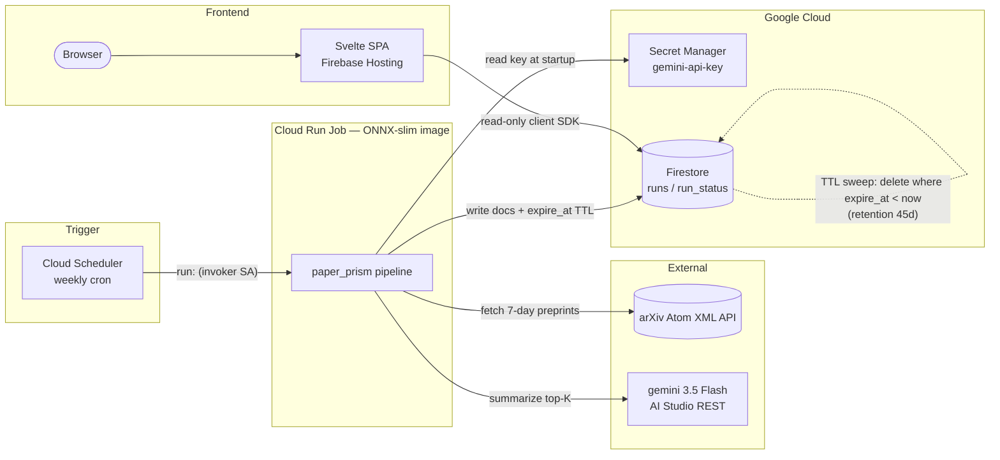
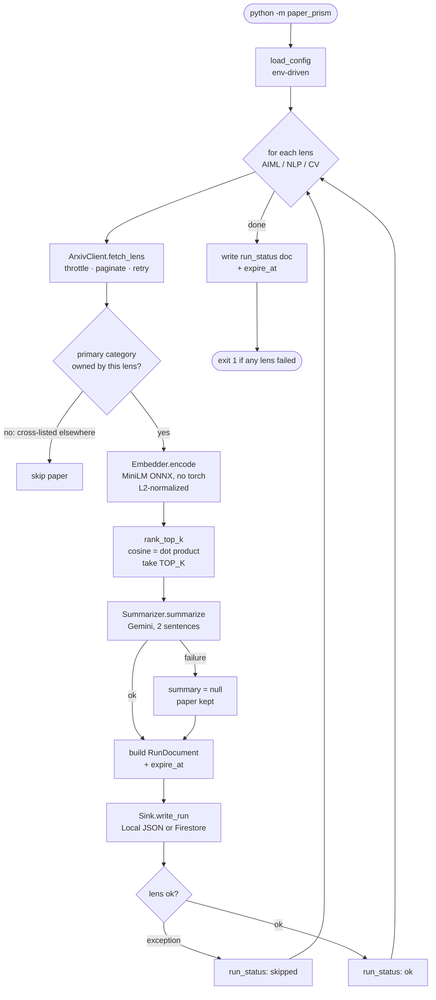
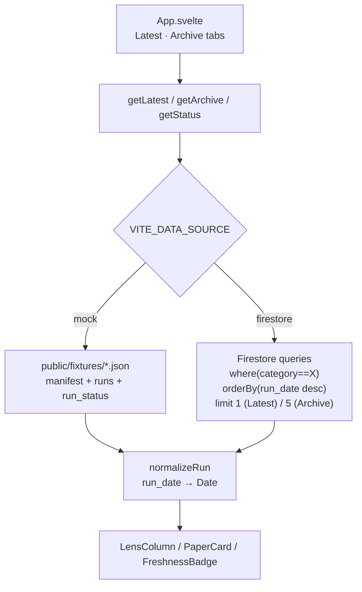
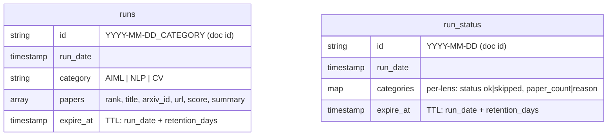

# paper-prism — Architecture

Visual companion to `paper-prism-prd.md`. Three loosely-coupled components joined
only by the Firestore document schema: a batch **pipeline** writes, a **web** SPA
reads, and **infra** provisions the GCP stack.

## System flow (deploy-time + run-time)

Ranking is authoritative (local cosine); Gemini only summarizes. The browser
never writes — `firestore.rules` allows public read, `write: if false`; the job
writes server-side under a service account that bypasses rules.

## Pipeline internals (per run)

`Pipeline.run()` loops the three lenses **best-effort**: one lens failing is
recorded as `skipped` and does not abort the others.

**Lens → arXiv source mapping** (disjoint sets; a paper's *primary* category maps
it to at most one lens):

| Lens (`category`) | arXiv sources |
|---|---|
| `AIML` | `cs.LG`, `cs.AI` |
| `NLP` | `cs.CL` |
| `CV` | `cs.CV` |

## Web data path

`web/src/lib/data.js` is a source abstraction; `VITE_DATA_SOURCE` swaps the
backend behind identical return shapes. The Firebase SDK is dynamically imported,
so `mock` builds never ship it.

Latest/Archive queries require the composite index on `(category ASC, run_date
DESC)` declared in both `firestore.indexes.json` and `infra/main.tf`.

`VITE_FIRESTORE_DATABASE` (passed to `getFirestore(app, id)`; unset → `(default)`)
selects the Firestore database the browser reads. It **must match the pipeline's
`FIRESTORE_DATABASE`** (default `feed-mind-db`) — the read path is direct from the
browser, so a mismatch silently reads an empty `(default)`.

## Shared data contract (Firestore)

The one hard coupling across components — defined in
`pipeline/src/paper_prism/models.py`, consumed in `web/src/lib/data.js`.

Doc IDs are deterministic, so re-runs overwrite idempotently.

## Provisioning: two parallel paths

`infra/` (Terraform, IaC source of truth) and `pipeline/deploy/*.sh` (imperative
`gcloud`) create the **same** GCP resources — Artifact Registry, Firestore
(named database via `FIRESTORE_DATABASE` / `var.firestore_database`, default
`feed-mind-db`) + index + TTL policies, two service accounts (least-privilege job
SA + scheduler invoker SA), the Gemini secret, the Cloud Run Job, and the weekly
Scheduler. Use one; running both double-creates. On the gcloud path,
`pipeline/deploy/01b-setup-firestore-db.sh` provisions the named database.
